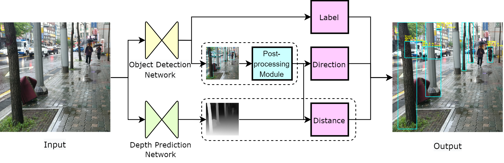

**GuideDogNet**: A Deep Learning Model for Guiding the Blind in Walking Environments through Object Detection and Depth Prediction Algorithms 
==========
GuideDogNet is a novel deep learning-based blind guiding system. It guides the blind on behalf the guide dogs. 

The proposed system consists of an object detection network, depth prediction network, and post-processing module. To provide user-friendly outputs for the blind, we propose a rule-based post-processing module that outputs the label, direction, and distance of the obstacles by combining the results of the object detection network and the depth prediction network. 



We achieved an mAP of 67.8 on the AI Hub Sidewalks dataset which is publicly available. To the best of our knowledge, this is the first attempt at a deep learning-based blind guiding system. 


Result of GuideDogNet. The proposed system shows the label, distance, and direction of the obstacles from the RGB image.

<table>
    <thead>
        <tr style="text-align: right;">
            <th></th>
            <th>name</th>
            <th>backbone</th>
            <th>positional encoding</th>
            <th>mAP</th>
        </tr>
    </thead>
    <tbody>
        <tr>
            <th>0</th>
            <th>DETR</th>
            <th>R50</th>
            <th>sine</th>
            <th>67.8</th>
        </tr>
        <tr>
            <th>0</th>
            <th>DETR-DC5</th>
            <th>R50</th>
            <th>swine</th>
            <th>68.2</th>
        </tr>
    </tbody>
</table>


## How to Run
to test the proposed network, run following code
```shell
python run_depth.py
python run_objectdet.py
python post_proc.py
```

## Citation
If you find this work useful, plead cite:
```
@inproceedings{GuideDogNet,
    title={GuideDogNet: A Deep Learning Model for Guiding the Blind in Walking Environments through Object Detection and Depth Prediction Algorithms},
    author={Yunseo Hwang},
    booktitle={},
    year={},
    pubstate={},
    tppubtype={}
}
```
Please direct any questions to Yunseo Hwang at solution0629@gmail.com